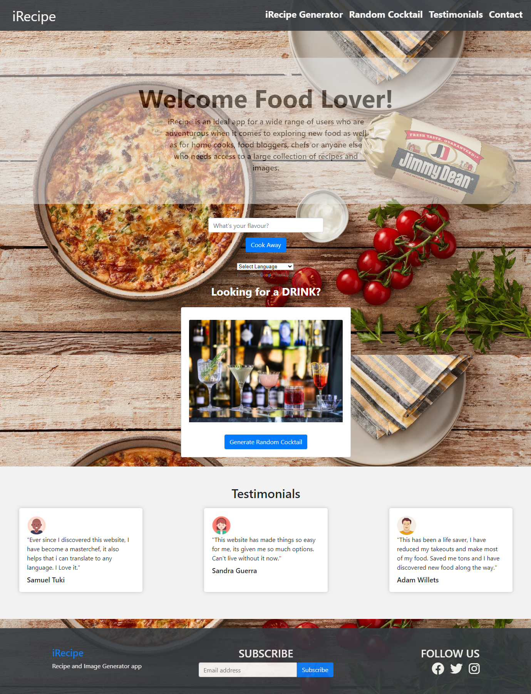

# Project's Title

iRecipe - Recipe Generator App with Translation Capability

## Description 

iRecipe is a real-world front-end application recipe and food image generator app that provides users with access to a large collection of recipes and corresponding images, including international dishes. 

Users can search for recipes based on ingredients and name of the dish, it provides information on ingredients, instructions, and other details for each recipe. It includes a translation feature to view recipes in the user's preferred language.

In addition to food recipes, the app also features a random cocktail recipe generator, giving users a chance to explore new and exciting drinks. The app provides images of the finished dishes to help users visualize the recipes and get an idea of what the final product should look like.

iRecipe is an ideal app for a wide range of users, including home cooks, food bloggers, chefs, and anyone else who needs access to a large collection of recipes. The app runs in the browser and features dynamically updated HTML and CSS with Bootstrap classes to make it responsive, powered by JavaScript.

## Features

- Access to a wide collection of recipes and related images
- Step-by-step instructions 
- Information on ingredients and other details for each recipe
- Translation
- Random cocktail recipe generator

## Screenshot

## Tech Stack

- JavaScript 
- HTML
- CSS
- Bootstrap
- Spoonacular API
- Cocktails API
- Canva
- DOM Manipulation
- Google Translator

## Getting Started

Getting started with iRecipe is easy. Simply click the live Site URL link and start exploring the world of cooking and cocktail making like never before. With iRecipe, you'll have access to a wide collection of recipes and images to inspire your next meal. Whether you're looking to cook an Italian dish or a Chinese one, our app offers translation capabilities, allowing you to explore new cuisines and flavors with ease. Additionally, our app offers a random cocktail generator feature, enabling you to discover new and exciting drinks that you may not have considered before.

## Links to the deployed application and the GitHub repository

- Live Site URL:  https://samueltuki.github.io/iRecipe/
- Project URL: https://github.com/samueltuki/iRecipe

## Author

- Adam Willetts
- Ahme Oshiokhai
- Sandra Guerra
- Tuki Samuel

## Copyright

© 2023 
